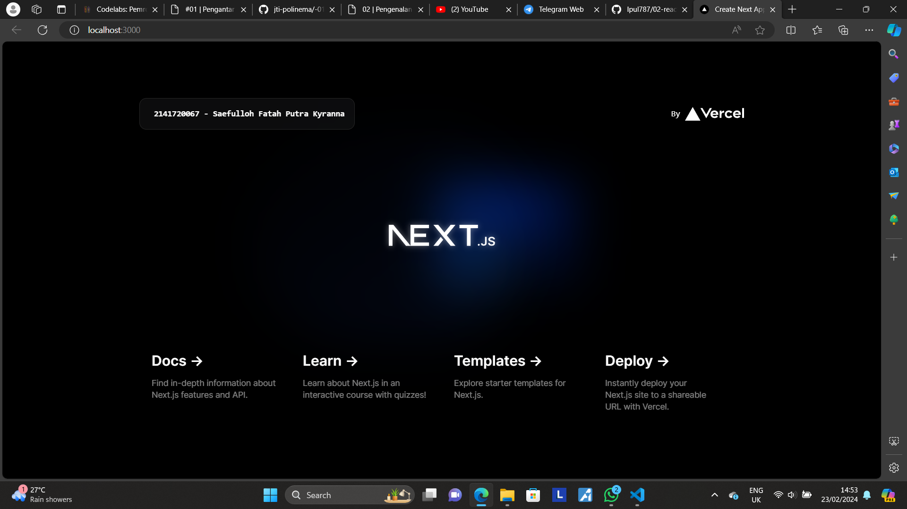

This is a [Next.js](https://nextjs.org/) project bootstrapped with [`create-next-app`](https://github.com/vercel/next.js/tree/canary/packages/create-next-app).

## Getting Started

First, run the development server:

```bash
npm run dev
# or
yarn dev
# or
pnpm dev
# or
bun dev
```

Open [http://localhost:3000](http://localhost:3000) with your browser to see the result.

You can start editing the page by modifying `app/page.tsx`. The page auto-updates as you edit the file.

This project uses [`next/font`](https://nextjs.org/docs/basic-features/font-optimization) to automatically optimize and load Inter, a custom Google Font.

## Practicum Report

|  | Framework Based Programming 2024 |
|--|--|
| NIM |  2141720067|
| Nama |  Saefulloh Fatah Putra Kyranna |
| Kelas | TI - 3I |

## Answer of Question no. 1

Github Repository: https://github.com/Ipul787/02-react-hello-world 

## Answer of Question no. 2

1. Explanation of things

TypeScript: TypeScript is a superset of JavaScript and it adds static typing to the language. This allows developers to catch errors early in development process. 

ESLint: ESLint is a static code analysis tool to identify problematic patterns in JavaScript code. It helps enforce a particular coding style and best practices on a project, ensuring consistency and minimizing bugs. 

Tailwind CSS: Tailwind CSS is a CSS framework that provide slow-level utility classes to rapidly build custom designs. This approach offers more flexibility and allows for rapid deployment without writing another CSS file. 

App Router: App Router refers to a collection of routers or module used in web development frameworks to handle routing in web application. 

Import alias: Import alias is a feature in modern JS and TypeScript that allows developeers to define alternative names for modules or paths when importing them into a file. 

2. Explanation of files

node_modules: This folder contains all dependencies for the project when they are installed.

public: This folder contains static assets such as HTML files, fonts, images, and other resources that don't need to be processed with Webpack. 

src:This is where main source code for the application resides. 

.git: This folder contains all information required for Git to manage the repository, including Repository Metadata, Index, Hookds, Configuration Files, and others. 

eslintrc.json: This file contains configuration settings for ESLint and allows the developer to customize ESLint rules, environments, and plugins for best practices in the project. 

.gitignore: This file specifies which files and directories that should be ignored by Git. 

next.config.mjs: This is used in Next.js projects to configure custom settings for Next.js framework. 

next-env.d.ts: This is used in Next.js projects and contains TypeScript declarations for the runtime environment. 

package.json: This file contains metadata for the project and its dependencies and also includes scripts for running development server, project build, and running tests. 

package-lock.json: This file locks the versions of the project dependencies to ensure consistent builds. 

postcss.config.js: This is a tool for transforming CSS with JavaScript plugins that allows the developer to specify PostCSS plugins. 

README.md: This file contains information about the project. 

tailwind.config.js: This is a utility-first CSS framework that allowed the customization of Tailwind CSS's default settings and extend its utility classes. 

tsconfig.json: This file contains configurations for TypeScript. 

## Answer of Question no. 3



The change happened without re-running npm run dev because react saves every change in real-time environment. 

## Answer of Question no. 4
